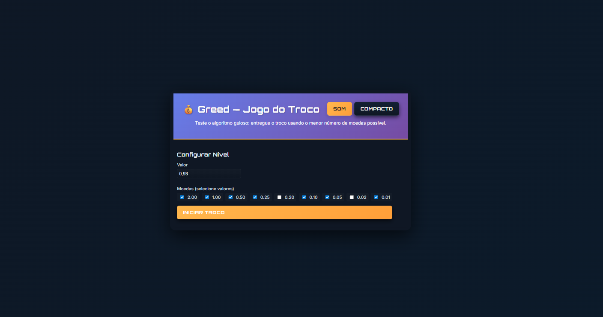
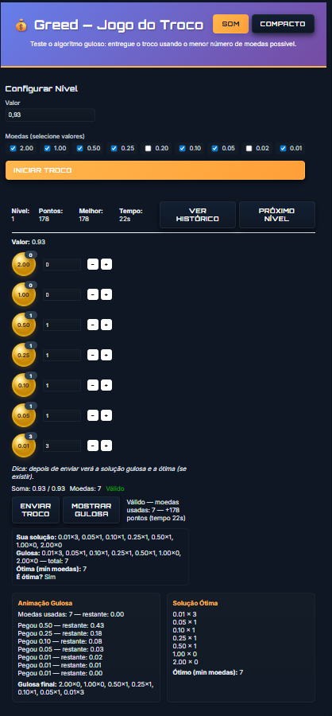

# Greed — Jogo do Troco

Este repositório contém uma implementação didática do jogo "Greed" (troco). O objetivo é formar um valor usando moedas, comparando sua solução com a solução gulosa e com a solução ótima (quando disponível).

**Principais tópicos nesta versão**
- Backend: Flask (API  em `app.py`)
- Lógica do jogo: `src/game.py`, `src/player.py`, `src/ui.py`
- Frontend: módulos ES em `static/js/` e templates em `templates/`


**Requisitos**
- Python 3.10+ (ambiente virtual recomendado)
- Dependências listadas em `requirements.txt`

## Instalação rápida

Windows (PowerShell):

```powershell
python -m venv .venv
.venv\Scripts\Activate.ps1
pip install -r requirements.txt
```

## Executar a aplicação

```powershell
python app.py
```

Abra no navegador: http://127.0.0.1:5000

## Executar testes

```powershell
python -m pytest
```

Os testes usam `pytest` e o diretório `tests/` contém casos para a lógica principal.

## Estrutura do projeto

- `app.py` — entrada do servidor Flask e endpoints API
- `src/` — lógica do jogo (`game.py`, `player.py`, `ui.py`, wrapper `greed_game.py`)
- `static/js/` — scripts front-end modulados (`api.js`, `game-ui.js`, `history.js`)
- `templates/` — páginas HTML (`index.html`, `history.html`)
- `tests/` — testes automatizados com `pytest`

## Notas de desenvolvimento

- Se fizer alterações em `src/`, rode os testes com `python -m pytest`.
- Frontend usa ES modules; o servidor serve os arquivos estáticos. Faça hard-refresh ao atualizar `static/js/*`.


## Exemplos de requests API

Endpoints principais:

- `POST /api/greed/init` — inicializa um nível
	- Payload JSON exemplo:


- `POST /api/greed/submit` — submete a escolha do jogador
	- Payload JSON exemplo:


## Seção para screenshots


```markdown


```


